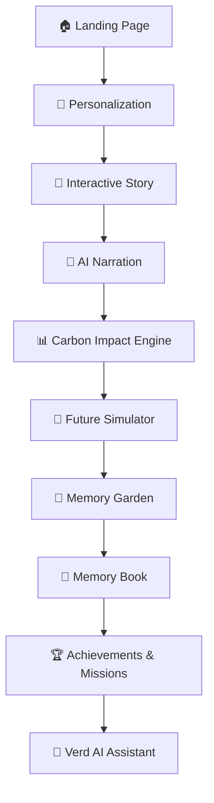
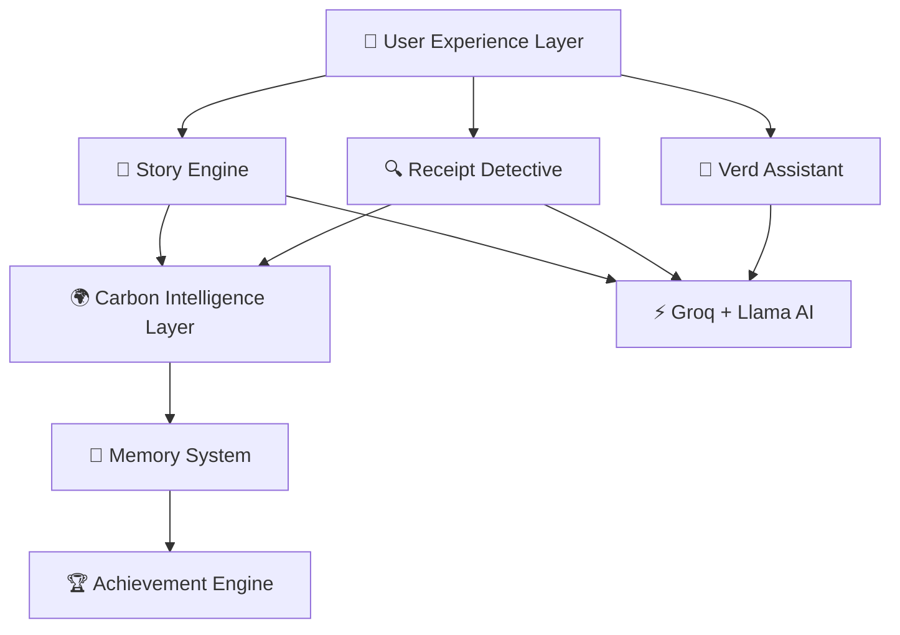
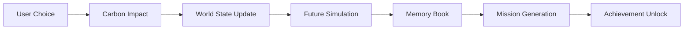

<div align="center">

# 🌍 CarbonVerse — Rewrite Your Future

## 🎥 Project Demo

🌐 Live Demo: https://carbon-verse-nu.vercel.app/

📂 Repository: https://github.com/rahulasthwik1307/CarbonVerse

### *An AI-powered story-driven sustainability experience that transforms everyday choices into a living future.*

<br />

[](https://carbon-verse-nu.vercel.app/)
[](https://nextjs.org/)
[](https://groq.com/)
[](https://vercel.com/)

<br />


<br />

**[🌐 Live Demo](https://carbon-verse-nu.vercel.app/)** · **[🎯 Features](#-core-features)** · **[🏗️ Architecture](#-architecture)** · **[🛠️ Tech Stack](#-tech-stack)**

</div>

---

<br />

## 🎬 Demo

### Live Experience

https://carbon-verse-nu.vercel.app/

### Core Journey

🏠 Landing
→ 📖 Story
→ 🌆 Future
→ 🌳 Garden
→ 📖 Memory Book
→ 🏆 Achievements
→ 🤖 Verd Assistant

---

<br />

## 📌 The Problem

Most sustainability tools **fail** — not because the data is wrong, but because the experience is broken.

| ❌ What Exists Today | 💡 What's Missing |
|---|---|
| Static dashboards with raw numbers | **Emotional connection** to impact |
| Complex carbon calculators | **Intuitive, effortless** understanding |
| One-time audit reports | **Ongoing engagement** and habit building |
| Data-heavy interfaces | **Story-first** interaction design |
| Forgettable tools | **Memorable, personal** experiences |

> **Users don't abandon sustainability because they don't care — they abandon it because nothing makes them *feel* the consequence of their choices.**

CarbonVerse solves this by **turning sustainability into an interactive narrative journey** where every decision you make shapes a living, breathing future world.

---

<br />

## 💡 The Solution

**CarbonVerse is not a calculator. It's an experience.**

Users don't fill forms. **Users live a story.**

Every decision ripples through an interconnected system that transforms:

| Your Choice | What Changes |
|---|---|
| 🍳 Breakfast decision | Carbon footprint + future AQI |
| 🚗 Commute method | City pollution + world state |
| 🛒 Shopping habits | Personal memory garden growth |
| 🌙 Evening wind-down | Achievement unlocks + mission generation |

> **One story. Six decisions. An entire future rewritten.**

The result is a **personal sustainability journey** captured in a Memory Book — a visual timeline of your choices, their impact, and the future you're building.

---

<br />

## 🔄 Experience Flow



The CarbonVerse journey transforms everyday decisions into a persistent sustainability experience where each step influences future simulations, achievements, and personal environmental memories.

---

<br />

## ✨ Core Features

<table>
<tr>
<td width="50%" valign="top">

### 🌱 Story-Driven Carbon Education

Traditional tools bombard users with numbers. CarbonVerse wraps sustainability education inside an **interactive narrative** — each scene presents a real-life decision (breakfast, commute, lunch, shopping, dinner, wind-down) and reveals the carbon consequence through **AI-generated storytelling**, not spreadsheets.

</td>
<td width="50%" valign="top">

### 🌍 Future Simulator

Your choices don't just calculate a number — they **transform a city**. The Future Simulator renders a visual representation of the world your decisions create by 2050. Sustainable choices paint a greener, cleaner skyline. Wasteful ones show the consequences in real-time environmental decline.

</td>
</tr>
<tr>
<td width="50%" valign="top">

### 🌳 Memory Garden

A **living visual reward system** that evolves based on your sustainability decisions. Each positive choice plants a seed — watch your garden bloom with trees, flowers, and wildlife as you progress through the story. It's a beautiful, tangible representation of your environmental impact.

</td>
<td width="50%" valign="top">

### 📖 Carbon Memory Book

Your personal environmental autobiography. The Memory Book is a **visual timeline** that tracks:
- 📝 Story journey decisions & outcomes
- 🧾 Receipt Detective analyses
- 🎯 Mission completions
- 🏆 Achievement unlocks
- 📊 Cumulative sustainability history

</td>
</tr>
<tr>
<td width="50%" valign="top">

### 🏆 Achievement System

Dynamic, unlockable sustainability badges that celebrate milestones. From *"First Green Choice"* to *"Carbon Neutral Champion"* — achievements create a compelling feedback loop that rewards consistent sustainable behavior and keeps users engaged.

</td>
<td width="50%" valign="top">

### 🎯 Mission System

**Personalized action missions** generated directly from your behavior. Made a high-carbon commute choice? CarbonVerse generates a targeted mission to try public transit this week. Missions bridge the gap between virtual choices and **real-world sustainability action**.

</td>
</tr>
<tr>
<td width="50%" valign="top">

### 🔍 Receipt Detective

AI-powered receipt analysis that brings **real-world purchases** into the CarbonVerse ecosystem.

**Supports:** Food · Electricity · Fuel · Shopping

**Generates:** Carbon estimates · Verd insights · Personalized missions · Memory Book entries

Upload any receipt and instantly understand its environmental footprint.

</td>
<td width="50%" valign="top">

### 🤖 Verd AI Assistant

A hybrid AI sustainability coach powered by **Groq + Llama**. Verd is context-aware and can:
- 💨 Explain your carbon footprint breakdown
- 🌬️ Interpret AQI and air quality data
- 🏭 Detail emission sources and impacts
- 🗺️ Guide real-world sustainability actions
- 💡 Provide personalized, contextual advice

</td>
</tr>
</table>

---

<br />

## 🧠 AI Capabilities

CarbonVerse leverages **Groq's ultra-fast inference** with Llama models to power intelligent, context-aware features across the entire experience.

| Capability | Purpose | Integration Point |
|---|---|---|
| 🧾 **Receipt Analysis** | Extracts items, estimates carbon, generates insights | Receipt Detective |
| 🎯 **Mission Generation** | Creates personalized sustainability action plans | Mission System |
| 🧭 **Context-Aware Coaching** | Provides guidance based on user's history & choices | Verd Assistant |
| 📖 **Environmental Narration** | Generates dynamic story outcomes from decisions | Story Engine |
| 🌿 **Sustainability Guidance** | Answers questions about emissions, AQI, footprints | Verd Assistant |
| 📊 **Carbon Insight Generation** | Transforms raw data into meaningful observations | Memory Book |

---

<br />

## 🛠️ Tech Stack

| Layer | Technology | Purpose |
|---|---|---|
| **Framework** |  | App Router, Server Components, API Routes |
| **Language** |  | Type-safe development across the stack |
| **Styling** |  | Utility-first responsive design system |
| **Animation** |  | Smooth micro-animations & page transitions |
| **3D Graphics** |  | Immersive 3D landing experience |
| **Animation** |  | Advanced scroll & timeline animations |
| **State** |  | Lightweight, scalable global state |
| **UI Components** |   | Accessible, composable primitives |
| **AI Engine** |  | Ultra-fast LLM inference |
| **AI Models** |  | Context-aware generation & analysis |
| **Audio** |  | Ambient soundscapes & audio feedback |
| **Icons** |  | Consistent, beautiful iconography |
| **Deployment** |  | Edge-optimized global deployment |

---

<br />

## 🏗️ Architecture



### Architectural Breakdown

CarbonVerse is architected with a decoupled, layer-based design:
* **User Experience Layer**: Immersive React components serving the landing, story walkthrough, AI Coach (Verd), and Receipt Detective interfaces.
* **Core Processing Engines**: Story logic, Receipt Detective, and Verd assistant orchestration.
* **Carbon Intelligence Layer**: Evaluates environmental metrics, updates the 2050 simulator, and maps emission data.
* **AI Layer (Groq)**: Powers fast Llama inference endpoints (`/api/story`, `/api/detective`, `/api/coach`).
* **Memory & Achievements**: Client-side Zustand stores tracking user state, triggering badges, and logging journey history into the Memory Book.

### Architecture Principles

| Principle | Implementation |
|---|---|
| **Server-First AI** | All AI calls routed through Next.js API routes — zero client-side API key exposure |
| **Reactive State** | Zustand stores propagate changes instantly across all connected components |
| **Modular Features** | Each feature (story, detective, memory, coach) is a self-contained module |
| **Edge Deployment** | Vercel Edge Network ensures sub-100ms response times globally |

---

<br />

## ⚙️ How CarbonVerse Makes Decisions

Every interaction triggers a **cascade of interconnected system updates:**



Every choice propagates through multiple interconnected systems, creating a living sustainability profile rather than a static carbon score.

---

<br />

## ♿ Accessibility

| Feature | Details |
|---|---|
| 📱 **Responsive Design** | Fluid layouts that adapt seamlessly from mobile to ultrawide |
| 📲 **Mobile Optimized** | Touch-friendly interactions, swipe navigation |
| 🔤 **Clear Typography** | Legible font hierarchy with consistent sizing |
| 🎨 **High Contrast UI** | Dark theme with carefully selected contrast ratios |
| 🧘 **Reduced Cognitive Load** | Story-first interaction — one decision at a time |
| 🎭 **Narrative UX** | Information delivered through story, not data dumps |

---

<br />

## 🔒 Security

| Measure | Implementation |
|---|---|
| 🔐 **Environment Variables** | All API keys stored in `.env.local`, never committed |
| 🛡️ **Secure API Routes** | AI calls proxied through server-side Next.js routes |
| 🚫 **No Exposed Secrets** | Zero client-side API key access |
| 🧱 **Client-Server Separation** | Clear boundary between frontend and AI backend |
| ✅ **Input Validation** | All user inputs sanitized before processing |

---

<br />

## 📐 Code Quality

| Practice | Details |
|---|---|
| 🏷️ **TypeScript** | End-to-end type safety across components, stores, and API routes |
| 🧩 **Modular Components** | Feature-isolated component architecture (`story/`, `detective/`, `memory/`, `coach/`) |
| 📦 **Zustand Architecture** | Centralized, predictable state management with minimal boilerplate |
| ♻️ **Reusable UI** | Shared primitives via Radix UI and shadcn/ui component library |
| 📁 **Feature Separation** | Clean directory structure mapping features to routes and components |
| 🔧 **Maintainable Structure** | Consistent patterns, clear naming, and well-defined boundaries |

---

<br />

## 🔮 Future Improvements

| Enhancement | Description |
|---|---|
| 🌐 **Multi-Language Support** | Localized stories and UI for global accessibility |
| 👥 **Community Challenges** | Collaborative sustainability goals with friends and groups |
| 📉 **Carbon Reduction Goals** | Long-term tracking with progress milestones |
| 🧠 **AI Sustainability Plans** | Personalized multi-week action plans generated by AI |
| 🌡️ **Real-Time Environmental Data** | Live AQI, weather, and emissions API integrations |
| 📊 **Impact Analytics Dashboard** | Aggregate community impact visualization |
| 🎮 **Gamified Streaks** | Daily engagement streaks with reward multipliers |

---

<br />

## 🏆 Why CarbonVerse Stands Out

<table>
<tr>
<td width="50%" valign="top">

### ❌ What Others Build

- Carbon calculators with form fields
- Static dashboards with charts
- One-time reports you never revisit
- Data-heavy interfaces that overwhelm
- Tools that inform but don't inspire

</td>
<td width="50%" valign="top">

### ✅ What CarbonVerse Is

- **A living narrative** where you are the protagonist
- **A future simulator** that shows consequences, not numbers
- **A Memory Book** that creates lasting emotional connection
- **An AI coach** that guides you personally
- **An experience** that transforms behavior

</td>
</tr>
</table>

> **CarbonVerse doesn't show you a number and hope you care.**
> 
> **It shows you a future — and makes you want to change it.**

---

<br />

## 🚀 Getting Started

**Project Demo:** [https://carbon-verse-nu.vercel.app/](https://carbon-verse-nu.vercel.app/)

```bash
# Clone the repository
git clone https://github.com/rahulasthwik1307/CarbonVerse.git

# Install dependencies
npm install

# Set up environment variables
cp .env.example .env.local
# Add your GROQ_API_KEY to .env.local

# Run the development server
npm run dev
```

Open [http://localhost:3000](http://localhost:3000) to begin your journey.

---

<br />

## 🙏 Credits

<div align="center">

Built with passion using


<br />

---

*"Small choices create big futures."* 🌱

</div>
